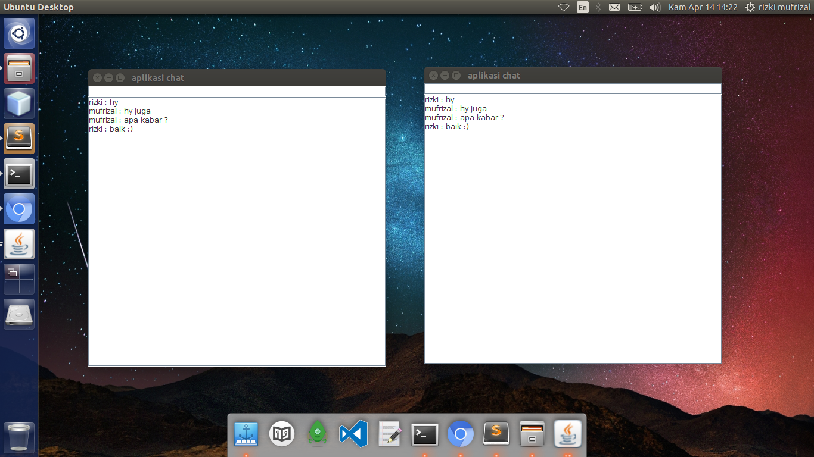
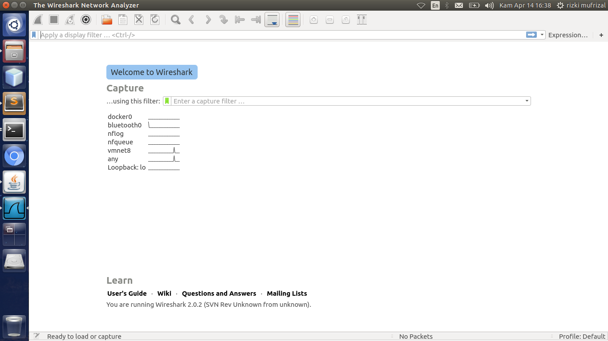
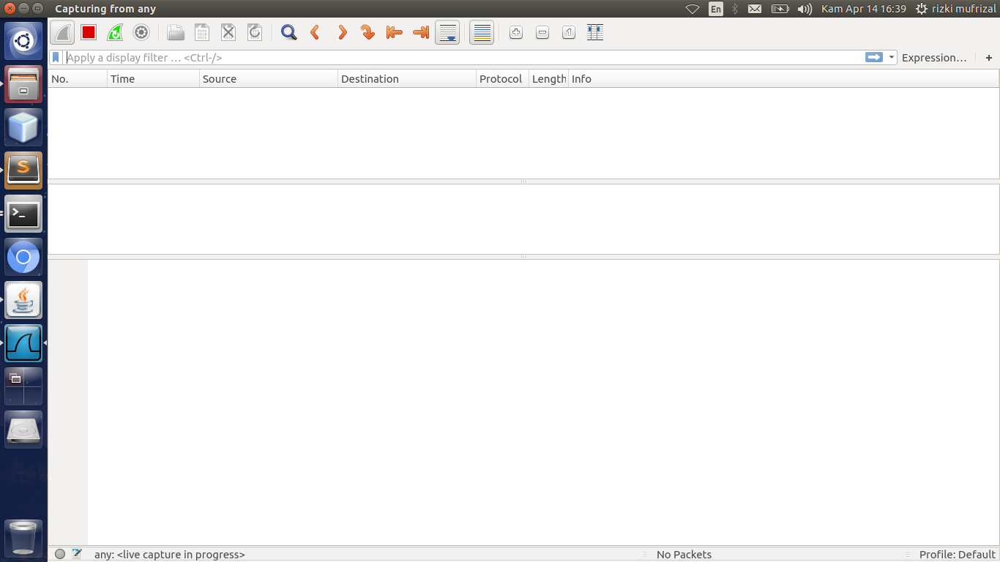
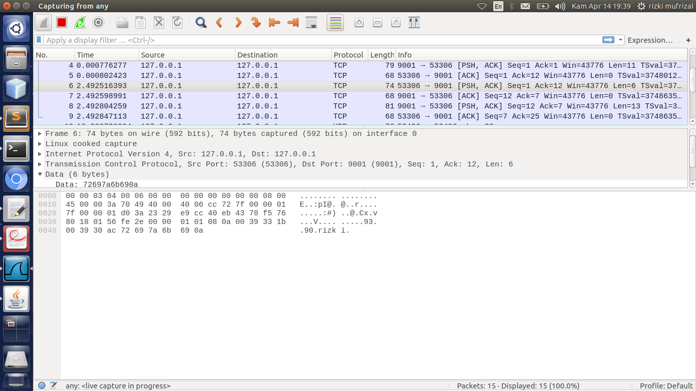
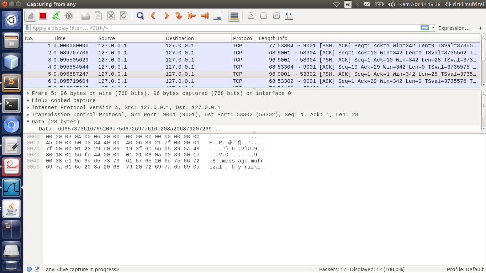
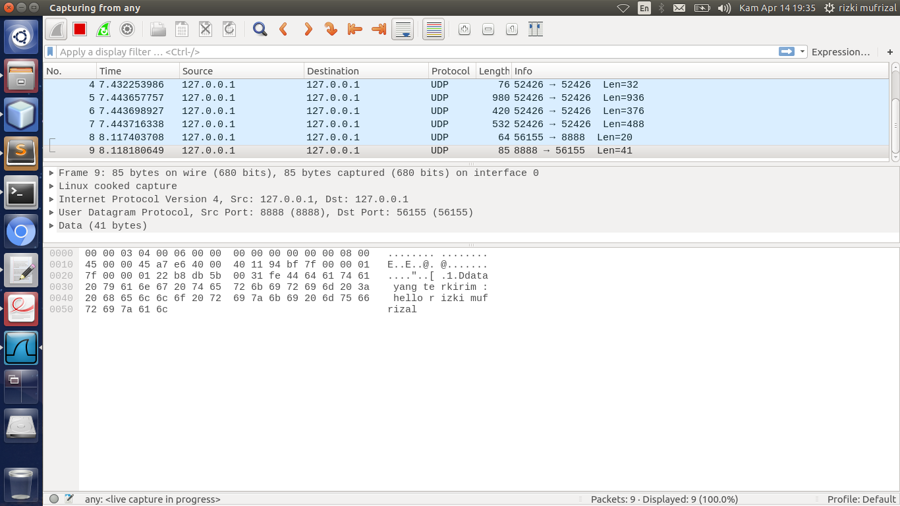

## Apa Itu Socket ?

>>Socket adalah mekanisme komunikasi untuk pertukaran data antar aplikasi yang terdapat di dalam sebuah mesin maupun beda mesin dan pertukaran ini terjadi pada sebuah jaringan komputer.

Untuk membangun sebuah aplikasi yang berbasis socket, kita dapat menggunakan 2 jenis socket yang berbeda yaitu :

* TCP Socket : menggunakan  konsep connection oriented dan reliable data transfer sehingga aplikasi yang dibangun dengan TCP Socket tidak mempedulikan lama waktu sebuah pengiriman data akan tetapi sangat mementingkan ketepatan data. Konsep connection oriented adalah suatu proses pengiriman data disertai dengan tanggung jawab sehingga ketika data sampai pada tujuan akan ada pemberitahuan atau jika terjadi kesalahan pada saat pengiriman data maka data tersebut akan dikirim kembali ke tujuannya. Konsep reliable data transfer adalah sebuah proses pengiriman data dengan menggunakan nomor urut sehingga pada saat diterima, data akan tersusun berdasarkan nomor urut tersebut.

* UDP Socket : menggunakan konsep connectionless oriented dan unreliable data transfer sehingga aplikasi yang dibangun dengan UDP Socket tidak mementingkan ketepatan data tetapi lebih mementingkan akan delay waktu pada saat proses pengiriman data. Konsep connectionless oriented adalah suatu proses pengiriman data tidak disertai dengan tanggung jawab sehingga jika terjadi kesalahan pada saat proses pengiriman maka data tersebut tidak akan dikirim ulang ke tujuan. Konsep unreliable data transfer adalah sebuah proses pengiriman data dalam bentuk datagram tanpa nomor urut.

## Implementasi TCP Socket

Pada artikel ini, penulis akan melakukan implementasi TCP Socket dengan menggunakan bahasa pemrograman java. Silahkan buat sebuah file dengan nama `ServerChat.java` kemudian masukkan codingan seperti berikut.


import java.io.BufferedReader;
import java.io.IOException;
import java.io.InputStreamReader;
import java.io.PrintWriter;
import java.net.ServerSocket;
import java.net.Socket;
import java.util.HashSet;

/*
 * ServerChat.java
 * Copyright (C) 2016 Rizki Mufrizal <mufrizalrizki@gmail.com>
 *
 * Distributed under terms of the MIT license.
 */

 public class ServerChat {

    private static final int PORT = 9001;
    private static HashSet<String> names = new HashSet<>();
    private static HashSet<PrintWriter> printWriters = new HashSet<>();

    public static void main(String[] args) throws IOException {
        System.out.println("server jalan pada port : " + PORT);
        ServerSocket serverSocket = new ServerSocket(PORT);
        try {
            while (true) {
                new Handler(serverSocket.accept()).start();
            }
        } catch (Exception e) {
            System.out.println(e);
        } finally {
            serverSocket.close();
        }
    }

    private static class Handler extends Thread {

        private String name;
        private Socket socket;
        private BufferedReader bufferedReader;
        private PrintWriter printWriter;

        public Handler(Socket socket) {
            this.socket = socket;
        }

        @Override
        public void run() {
            try {
                bufferedReader = new BufferedReader(new InputStreamReader(socket.getInputStream()));
                printWriter = new PrintWriter(socket.getOutputStream(), true);

                while (true) {
                    printWriter.println("submitname");
                    name = bufferedReader.readLine();

                    if (name == null) {
                        return;
                    }

                    synchronized (names) {
                    
                        if (!names.contains(name)) {
                            names.add(name);
                            break;
                        }
                    
                    }
                }

                printWriter.println("nameaccepted");
                printWriters.add(printWriter);

                while (true) {
                    String input = bufferedReader.readLine();
                    
                    if (input == null) {
                        return;
                    }
                    
                    printWriters.stream().forEach((pw) -> {
                        pw.println("message " + name + " : " + input);
                    });

                }

            } catch (IOException e) {
                System.out.println(e);
            } finally {

                if (name != null) {
                    names.remove(name);
                }
            
                if (printWriter != null) {
                    printWriters.remove(printWriter);
                }
            
                try {
                    socket.close();
                } catch (IOException e) {
                    System.out.println(e);
                }
            }
        }
    }
}


Pada codingan diatas, kita membuat 2 class di dalam satu file, dimana class Handler kita lakukan inheritance terhadap class Thread. Fungsinya adalah kita akan membuka koneksi dan menunggu permintaan koneksi dari client. Pada saat client melakukan koneksi ke server maka client akan melakukan syncronize dengan server atau client akan melakukan request ke server, kemudian server akan melakukan sycronize terhadap seluruh client yang terhubung pada jaringan sehingga ketika ada suatu aksi maka server akan memberikan response kepada semua client meskipun client tersebut tidak memberikan request ke server. Pada codingan diatas, server akan berjalan pada port 9001 sehingga client harus bisa melakukan koneksi pada jaringan dan port yang sama dengan server.

Tahap selanjutnya, kita akan membuat sebuah client, silahkan buat sebuah file dengan nama `ClientChat.java` kemudian masukkan codingan berikut.


import java.awt.event.ActionEvent;
import java.awt.Dimension;
import java.awt.Toolkit;
import java.io.BufferedReader;
import java.io.IOException;
import java.io.InputStreamReader;
import java.io.PrintWriter;
import java.net.Socket;
import javax.swing.JFrame;
import javax.swing.JOptionPane;
import javax.swing.JScrollPane;
import javax.swing.JTextArea;
import javax.swing.JTextField;

/*
 * ClientChat.java
 * Copyright (C) 2016 Rizki Mufrizal <mufrizalrizki@gmail.com>
 *
 * Distributed under terms of the MIT license.
 */

public class ClientChat {

    private BufferedReader bufferedReader;
    private PrintWriter printWriter;
    private JFrame jFrame = new JFrame("aplikasi chat");
    private JTextField jTextField = new JTextField(40);
    private JTextArea jTextArea = new JTextArea(8, 40);

    public ClientChat() {
        jTextField.setEditable(Boolean.FALSE);
        jTextArea.setEditable(Boolean.FALSE);
        jFrame.setSize(500, 500);
        jFrame.getContentPane().add(jTextField, "North");
        jFrame.getContentPane().add(new JScrollPane(jTextArea), "Center");
        Dimension dimension = Toolkit.getDefaultToolkit().getScreenSize();
        jFrame.setLocation((dimension.width / 2) - (jFrame.getSize().width / 2), (dimension.height / 2) - (jFrame.getSize().height / 2));

        jTextField.addActionListener((ActionEvent e) -> {
            printWriter.println(jTextField.getText());
            jTextField.setText("");
        });
    }

    public String getServerAddress() {
        return JOptionPane.showInputDialog(
            jFrame,
            "masukan ip address",
            "selamat datang di aplikasi chat",
            JOptionPane.QUESTION_MESSAGE
        );
    }

    public String getName() {
        return JOptionPane.showInputDialog(
            jFrame,
            "Masukkan nama anda",
            "selamat datang di aplikasi chat",
            JOptionPane.QUESTION_MESSAGE
        );
    }

    private void run() throws IOException {
        String serverAddress = getServerAddress();
        Socket socket = new Socket(serverAddress, 9001);
        bufferedReader = new BufferedReader(new InputStreamReader(socket.getInputStream()));
        printWriter = new PrintWriter(socket.getOutputStream(), true);

        while (true) {
            String line = bufferedReader.readLine();
            if (line.startsWith("submitname")) {
                printWriter.println(getName());
            } else if (line.startsWith("nameaccepted")) {
                jTextField.setEditable(Boolean.TRUE);
            } else if (line.startsWith("message")) {
                jTextArea.append(line.substring(8) + "\n");
            }
        }
    }

    public static void main(String[] args) throws IOException {
        ClientChat clientChat = new ClientChat();
        clientChat.jFrame.setDefaultCloseOperation(JFrame.EXIT_ON_CLOSE);
        clientChat.jFrame.setVisible(Boolean.TRUE);
        clientChat.run();
    }

}


Pada codingan diatas, kita membuat sebuah aplikasi chat untuk bagian client, port telah kita tentukan sesuai dengan port server yaitu 9001, sedangkan IP akan didefinisikan sendiri oleh user yang akan melakukan inputan. Aplikasi ini digunakan untuk melakukan chat secara group, misalkan jika terdapat 2 user maka kita dapat melakukan chat secara serentak, ketika user 1 melakukan chat maka secara otomatis user 2 akan mendapatkan balasan chat dari user 1 begitu pula sebaliknya.

### Uji Coba TCP Socket

Untuk melakukan uji coba TCP Socket, kita dapat menggunakan aplikasi [wireshark](https://www.wireshark.org/). Untuk melakukan instalasi wireshark, silahkan tambahkan ppa berikut.


sudo add-apt-repository ppa:wireshark-dev/stable


Kemudian lakukan update


sudo apt-get update


lalu lakukan instalasi aplikasi dengan perintah


sudo apt-get install wireshark


Tahap selanjutnya, silahkan lakukan compile kedua source code yang telah buat tadi, jalankan dengan perintah berikut untuk melakukan compile kedua file `ServerChat.java`.


javac ServerChat.java


kemudian jalankan dengan perintah


java ServerChat


Untuk melakukan compile file `ClientChat.java` maka jalankan perintah berikut.


javac ClientChat.java


kemudian jalankan dengan perintah


java ClientChat


Jalankan ClientChat sebanyak 2x sehingga akan muncul 2 form, 2 form ini merupakan representasi dari 2 client sehingga silahkan masukkan IP anda dengan 127.0.0.1 kemudian masukkan nama yang berbeda pada setiap form, kemudian lakukan chat antar client. Berikut adalah output dari aplikasi client tersebut.

Langkah selanjutnya adalah kita akan melakukan test dengan menggunakan wireshark, silahkan buka wireshark anda, berikut adalah tampilan dasboard nya.

Pada bagian dasboard terdapat proses capture, silahkan anda pilih any. Setelah selesai maka akan muncul seperti berikut.

arti dari gambar tersebut adalah aplikasi wireshark dengan melakukan capture terhadap jaringan yang sedang berjalan. Kemudian jalankan kembali aplikasi chat yang telah kita buat, pada saat aplikasi chat bagian client dijalankan maka pada aplikasi wireshark akan muncul seperti berikut.

Kemudian lakukan chat antar 2 client maka anda juga akan melihat ada proses pertukaran paket pada protokol TCP. Berikut adalah output ketika penulis melakukan chat.

## Implementasi UDP Socket

Setelah melakukan implementasi TCP Socket, tahap selanjutnya kita akan melakukan implementasi UDP Socket dengan bahasa pemrograman java :). Silahkan buat sebuah file dengan nama `UDPServer.java` lalu masukkan codingan seperti berikut.


import java.io.IOException;
import java.net.DatagramPacket;
import java.net.DatagramSocket;

/*
 * UDPServer.java
 * Copyright (C) 2016 Rizki Mufrizal <mufrizalrizki@gmail.com>
 *
 * Distributed under terms of the MIT license.
 */

public class UDPServer {

    public static void main(String args[]) {
        DatagramSocket datagramSocket = null;

        try {
            datagramSocket = new DatagramSocket(8888);

            byte[] buffer = new byte[65536];
            DatagramPacket datagramPacket = new DatagramPacket(buffer, buffer.length);

            System.out.println("socket server jalan, menunggu data yang dikirim");

            while (true) {
                datagramSocket.receive(datagramPacket);
                byte[] data = datagramPacket.getData();
                String s = new String(data, 0, datagramPacket.getLength());

                System.out.println(datagramPacket.getAddress().getHostAddress() + " : " + datagramPacket.getPort() + " : " + s);

                s = "data yang terkirim : " + s;
                DatagramPacket packet = new DatagramPacket(s.getBytes(), s.getBytes().length, datagramPacket.getAddress(), datagramPacket.getPort());
                datagramSocket.send(packet);
            }

        } catch (IOException e) {
            System.out.println(e);
        }
    }
}


Pada codingan diatas dapat dilihat bahwa server akan menunggu data yang dikirim dari client, data yang dikirim adalah packet dalam bentuk datagram sehingga packet tersebut tidak memiliki penomoran pada saat pengiriman berlangsung. 

Untuk kebutuhan testing, kita juga akan membuat sebuah client udp, silahkan buat sebuah file dengan nama `UDPClient.java` kemudian masukkan codingan berikut.


import java.io.BufferedReader;
import java.io.IOException;
import java.io.InputStreamReader;
import java.net.DatagramPacket;
import java.net.DatagramSocket;
import java.net.InetAddress;

/*
 * UDPClient.java
 * Copyright (C) 2016 Rizki Mufrizal <mufrizalrizki@gmail.com>
 *
 * Distributed under terms of the MIT license.
 */

public class UDPClient {

    public static void main(String args[]) {
        DatagramSocket datagramSocket = null;
        String s;
        BufferedReader bufferedReader = new BufferedReader(new InputStreamReader(System.in));

        try {
            datagramSocket = new DatagramSocket();
            InetAddress inetAddress = InetAddress.getByName("127.0.0.1");

            while (true) {
                System.out.print("Masukkan pesan anda : ");
                s = bufferedReader.readLine();
                byte[] b = s.getBytes();

                DatagramPacket datagramPacket = new DatagramPacket(b, b.length, inetAddress, 8888);
                datagramSocket.send(datagramPacket);

                byte[] buffer = new byte[65536];
                DatagramPacket packet = new DatagramPacket(buffer, buffer.length);
                datagramSocket.receive(packet);

                byte[] data = packet.getData();
                s = new String(data, 0, packet.getLength());

                System.out.println(packet.getAddress().getHostName() + " : " + packet.getPort() + " : " + s);
            }

        } catch (IOException e) {
            System.out.println(e);
        }
    }
}


Codingan diatas berfungsi sebagai client, dimana pada saat client dijalankan, anda dapat mengirim pesan ke server lalu server akan mengembalikan pesan anda kembali. Jika terdapat banyak client, maka pesan tersebut tidak akan syncronize dengan client yang lain akan tetapi pesan tersebut hanya syncronize dengan server.

### Uji Coba UDP Socket

Uji coba UDP dapat menggunakan `nmap`, `wireshark` dan juga aplikasi client yang telah kita buat tadi. Kita akan melakukan uji coba terlebih dahulu dengan menggunakan nmap. Silahkan lakukan instalasi nmap dengan perintah berikut.


sudo apt-get install nmap


Langkah selanjutnya silahkan lakukan compile file `UDPServer.java` lalu jalankan file tersebut. Kemudian kita akan mengecek terlebih dahulu status jaringan dengan perintah.


netstat -u -ap


Maka akan muncul output seperti berikut.


(Not all processes could be identified, non-owned process info
 will not be shown, you would have to be root to see it all.)
Active Internet connections (servers and established)
Proto Recv-Q Send-Q Local Address           Foreign Address         State       PID/Program name
udp        0      0 *:ipp                   *:*                                 -               
udp        0      0 *:mdns                  *:*                                 12151/          
udp        0      0 *:mdns                  *:*                                 -               
udp        0      0 *:51757                 *:*                                 -               
udp        0      0 localhost:52426         localhost:52426         ESTABLISHED -               
udp        0      0 *:52813                 *:*                                 -               
udp        0      0 10.42.0.1:domain        *:*                                 -               
udp        0      0 rizki-HP-431-Not:domain *:*                                 -               
udp        0      0 *:bootps                *:*                                 -               
udp        0      0 *:bootpc                *:*                                 -               
udp6       0      0 [::]:8888               [::]:*                              21206/java      
udp6       0      0 [::]:mdns               [::]:*                              -               
udp6       0      0 [::]:51861              [::]:*                              -               
udp6       0      0 [::]:4466               [::]:*                              - 


Bisa dilihat bahwa UDP Server telah berjalan sukses, bisa dilihat pada bagian PID/Program name terdapat kalimat `java` dan bertepatan dengan port 8888 yang telah kita konfigurasi pada codingan java. Langkah selanjutnya, untuk mengirim pesan ke server, silahkan jalankan perintah berikut.


ncat -vv localhost 8888 -u


Maksud dari perintah diatas adalah 
* -vv berfungsi untuk memberikan informasi secara detail
* -u berfungsi untuk mendeklarasikan protokol UDP

Jika berhasil, maka akan muncul output seperti berikut.


Ncat: Version 6.40 ( http://nmap.org/ncat )
libnsock nsi_new2(): nsi_new (IOD #1)
libnsock nsock_connect_udp(): UDP connection requested to 127.0.0.1:8888 (IOD #1) EID 8
libnsock nsock_trace_handler_callback(): Callback: CONNECT SUCCESS for EID 8 [127.0.0.1:8888]
Ncat: Connected to 127.0.0.1:8888.
libnsock nsi_new2(): nsi_new (IOD #2)
libnsock nsock_read(): Read request from IOD #1 [127.0.0.1:8888] (timeout: -1ms) EID 18
libnsock nsock_readbytes(): Read request for 0 bytes from IOD #2 [peer unspecified] EID 26


Kemudian silahkan ketikan pesan yang anda inginkan, jika berhasil maka anda akan mendapatkan response dari server, berikut adalah output nya.


Ncat: Version 6.40 ( http://nmap.org/ncat )
libnsock nsi_new2(): nsi_new (IOD #1)
libnsock nsock_connect_udp(): UDP connection requested to 127.0.0.1:8888 (IOD #1) EID 8
libnsock nsock_trace_handler_callback(): Callback: CONNECT SUCCESS for EID 8 [127.0.0.1:8888]
Ncat: Connected to 127.0.0.1:8888.
libnsock nsi_new2(): nsi_new (IOD #2)
libnsock nsock_read(): Read request from IOD #1 [127.0.0.1:8888] (timeout: -1ms) EID 18
libnsock nsock_readbytes(): Read request for 0 bytes from IOD #2 [peer unspecified] EID 26
hello rizki mufrizal
libnsock nsock_trace_handler_callback(): Callback: READ SUCCESS for EID 26 [peer unspecified] (21 bytes): hello rizki mufrizal.
libnsock nsock_trace_handler_callback(): Callback: WRITE SUCCESS for EID 35 [127.0.0.1:8888]
libnsock nsock_readbytes(): Read request for 0 bytes from IOD #2 [peer unspecified] EID 42
libnsock nsock_trace_handler_callback(): Callback: READ SUCCESS for EID 18 [127.0.0.1:8888] (42 bytes): data yang terkirim : hello rizki mufrizal.
data yang terkirim : hello rizki mufrizal
libnsock nsock_readbytes(): Read request for 0 bytes from IOD #1 [127.0.0.1:8888] EID 50


Jika kita cek pada bagian server, maka akan muncul output seperti berikut.


socket server jalan, menunggu data yang dikirim
127.0.0.1 : 34481 : hello rizki mufrizal


Tahap yang terakhir kita akan melakukan uji coba dengan menggunakan wireshark, silahkan matikan UDPServer, lalu jalankan kembali wireshark dan jalankan UDPServer. Setelah selesai, silahkan jalankan UDPClient kemudian silahkan kirimkan pesan. Berikut adalah output ketika terjadi pengiriman pesan dengan UDP Socket.

Sekian tutorial belajar socket programming dan Terima kasih :)