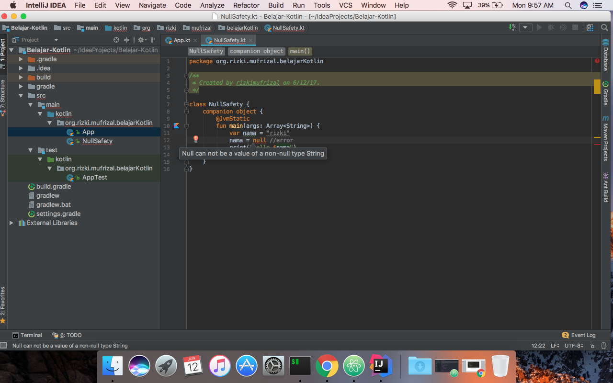
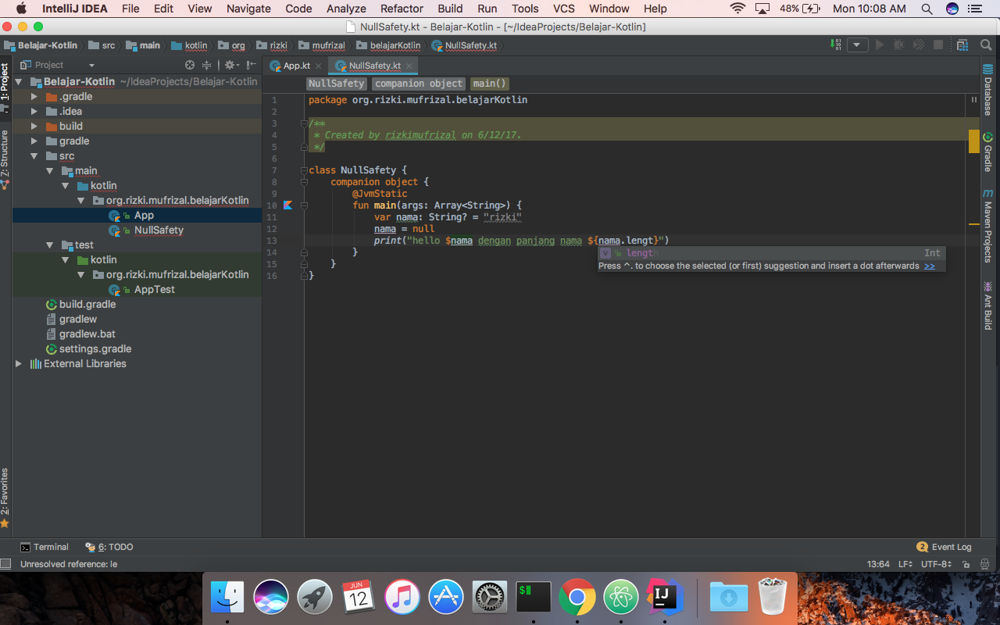

Pada artikel [sebelumnya](https://rizkimufrizal.github.io/setup-project-kotlin/), penulis telah membahas mengenai setup project kotlin dengan menggunakan gradle. Nah pada artikel ini, penulis akan membahas sedikit mengenai null safety pada kotlin.

## Apa Itu Null Safety

Sebagai developer java, anda pasti sering menemui yang namanya NullPointerException atau disingkat dengan NPE. Terkadang kita akan mengecek seluruh object apakah terdapat potensi NPE atau tidak dan NPE ini sangat sering terjadi terutama jika anda adalah android developer. Pada kotlin, anda dapat membedakan antara variabel yang boleh null dan yang tidak boleh null. Supaya lebih memahami, silahkan buka project yang dulu pernah anda buat, lalu buatlah sebuah file kotlin di dalam package `org.rizki.mufrizal.belajarKotlin` dengan nama `NullSafety`. Kemudian isikan codingan seperti berikut.


package org.rizki.mufrizal.belajarKotlin

/**
 * Created by rizkimufrizal on 6/12/17.
 */

class NullSafety {
    companion object {
        @JvmStatic
        fun main(args: Array<String>) {
            var nama = "rizki"
            nama = null //error
            print("hello $nama")
        }
    }
}


Dari codingan diatas, maka secara otomatis codingan anda akan error seperti berikut.

Error ini disebabkan karena secara default variabel pada kotlin tidak boleh diisi dengan null, sehingga dengan error ini developer lebih dapat mengatasi NPE. Agar variabel diatas dapat diisi dengan null maka silahkan ubah codingan nya menjadi seperti berikut.


package org.rizki.mufrizal.belajarKotlin

/**
 * Created by rizkimufrizal on 6/12/17.
 */

class NullSafety {
    companion object {
        @JvmStatic
        fun main(args: Array<String>) {
            var nama: String? = "rizki"
            nama = null
            print("hello $nama")
        }
    }
}


Tanda dari `?` berfungsi agar variabel tersebut dapat diisi dengan null. Oke langkah selanjutnya adalah ketika anda ingin mengetahui panjang dari suatu string, biasanya kita akan menggunakan function dari `length`, Jika anda menggunakan tanda `?` maka setiap mengakses function `length` maka anda wajib juga menyertakan tanda `?`, di IntelliJ IDEA, ketika anda mencoba mengakses function `length` tanpa tanda `?` maka warna nya akan gelap pertanda bahwa anda diwajibkan menggunakan tanda `?` seperti berikut.

Jika anda tidak menggunakan tanda `?` maka akan compiler akan memberitahukan error karena variabel memiliki nilai null. Untuk mengatasi hal demikian, silahkan ubah codingan menjadi seperti berikut.


package org.rizki.mufrizal.belajarKotlin

/**
 * Created by rizkimufrizal on 6/12/17.
 */

class NullSafety {
    companion object {
        @JvmStatic
        fun main(args: Array<String>) {
            var nama: String? = "rizki"
            nama = null
            print("hello $nama dengan panjang nama : ${nama?.length}")
        }
    }
}


Untuk mempermudah melakukan test, silahkan ubah codingan diatas menjadi seperti berikut.


package org.rizki.mufrizal.belajarKotlin

/**
 * Created by rizkimufrizal on 6/12/17.
 */

class NullSafety {

    fun nullOrNot(text: String?) = "hello $text dengan panjang text : ${text?.length}"

    companion object {
        @JvmStatic
        fun main(args: Array<String>) {
            println(NullSafety().nullOrNot(text = "rizki"))
            println(NullSafety().nullOrNot(text = null))
        }
    }
}


Jika pada codingan sebelumnya kita langsung melakukan print, maka pada codingan ini kita mendeklarasikan sebuah function dengan mengembalikan type data string. Pada function nullOrNot terdapat 1 parameter yaitu `text` dimana parameter ini dapat diisi dengan null dikarenakan menggunakan tanda `?`. Untuk mengembalikan data dalam bentuk string, kita dapat langsung melakukan return jika codingan hanya sebaris seperti codingan diatas dan tanpa perlu menggunakan keyword `return`.

Langkah selanjutnya, kita akan membuat test nya, silahkan buat sebuah kotlin file dengan nama `NullSafetyTest` di dalam package test, kemudian isikan codingan seperti berikut.


package org.rizki.mufrizal.belajarKotlin

import com.winterbe.expekt.should
import org.jetbrains.spek.api.Spek
import org.jetbrains.spek.api.dsl.given
import org.jetbrains.spek.api.dsl.it
import org.jetbrains.spek.api.dsl.on

/**
 * Created by rizkimufrizal on 6/12/17.
 */
class NullSafetyTest : Spek({
    given("a class NullSafety") {
        val nullSafety = NullSafety()
        on("set text to not null") {
            val textNotNull = nullSafety.nullOrNot(text = "rizki")
            it("should return not null") {
                textNotNull.should.equal("hello rizki dengan panjang text : 5")
            }
        }
        on("set text to null") {
            val textNull = nullSafety.nullOrNot(text = null)
            it("should return null") {
                textNull.should.equal("hello null dengan panjang text : null")
            }
        }
    }
})


## Memeriksa Null

Jika kita menggunakan tanda `?` maka jika anda mengakses suatu function contohnya `length` maka kita akan mendapatkan output null, terkadang kita ingin mengambalikan value yang lain. Alaternatif lain adalah dengan menggunakan fungsi `if`. Silahkan edit source code yang ada pada class `NullSafety` seperti berikut.


package org.rizki.mufrizal.belajarKotlin

/**
 * Created by rizkimufrizal on 6/12/17.
 */

class NullSafety {

    fun nullOrNot(text: String?) = "hello $text dengan panjang text : ${text?.length}"

    fun nullOrNotIf(text: String?) = if (text != null) "hello $text dengan panjang text : ${text.length}" else "Kosong / Isinya null"

    companion object {
        @JvmStatic
        fun main(args: Array<String>) {
            println(NullSafety().nullOrNot(text = "rizki"))
            println(NullSafety().nullOrNot(text = null))
            println(NullSafety().nullOrNotIf(text = "mufrizal"))
            println(NullSafety().nullOrNotIf(text = null))
        }
    }
}


Pada kodingan diatas kita ada penambahan 1 function yaitu `nullOrNotIf` dimana sebenarnya function ini juga sama dengan function `nullOrNot`, bedanya yaitu pada function ini kita melakukan pengecekan null terhadap variabel `text` sehingga pada saat kita mengakses function `length` dari variabel `text`, kita tidak perlu lagi menggunakan tanda `?`. Jika kita memasukkan null, maka nantinya akan dicetak `Kosong / Isinya null` sedangkan jika tidak null maka akan dicetak kalimat `hello mufrizal dengan panjang text : 8`.

Selain menggunakan `if else`, untuk mengecek null, kita juga dapat menggunakan `elvis`, silahkan ubah codingan seperti berikut.


package org.rizki.mufrizal.belajarKotlin

/**
 * Created by rizkimufrizal on 6/12/17.
 */

class NullSafety {

    fun nullOrNot(text: String?) = "hello $text dengan panjang text : ${text?.length}"

    fun nullOrNotIf(text: String?) = if (text != null) "hello $text dengan panjang text : ${text.length}" else "Kosong / Isinya null"

    fun nullOrNotElvis(text: String?): String {
        val length = text?.length ?: 0
        return if (length != 0) "hello $text dengan panjang text : $length" else "Kosong / Isinya null"
    }

    companion object {
        @JvmStatic
        fun main(args: Array<String>) {
            println(NullSafety().nullOrNot(text = "rizki"))
            println(NullSafety().nullOrNot(text = null))
            println(NullSafety().nullOrNotIf(text = "mufrizal"))
            println(NullSafety().nullOrNotIf(text = null))
            println(NullSafety().nullOrNotElvis(text = "rizki mufrizal"))
            println(NullSafety().nullOrNotElvis(text = null))
        }
    }
}


Dengan menggunakan elvis, kita hanya perlu menggunakan operator `?:`, sintak ini mirip dengan ternary operator. Jika `text?.length` tidak null maka akan dikembalikan nilai `text?.length`, sedangkan jika null maka akan dikembalikan nilai 0.

Dan yang terakhir adalah adanya operator `!!`, biasanya operator ini berfungsi untuk mengembalikan data yang benar - benar tidak null, jika null maka akan menghasilkan error, berikut adalah contoh penggunaan `!!`, silahkan ubah source code seperti berikut.


package org.rizki.mufrizal.belajarKotlin

/**
 * Created by rizkimufrizal on 6/12/17.
 */

class NullSafety {

    fun nullOrNot(text: String?) = "hello $text dengan panjang text : ${text?.length}"

    fun nullOrNotIf(text: String?) = if (text != null) "hello $text dengan panjang text : ${text.length}" else "Kosong / Isinya null"

    fun nullOrNotElvis(text: String?): String {
        val length = text?.length ?: 0
        return if (length != 0) "hello $text dengan panjang text : $length" else "Kosong / Isinya null"
    }

    fun nullOrNotNew(text: String?) = "hello $text dengan panjang text : ${text!!.length}"

    companion object {
        @JvmStatic
        fun main(args: Array<String>) {
            println(NullSafety().nullOrNot(text = "rizki"))
            println(NullSafety().nullOrNot(text = null))
            println(NullSafety().nullOrNotIf(text = "mufrizal"))
            println(NullSafety().nullOrNotIf(text = null))
            println(NullSafety().nullOrNotElvis(text = "rizki mufrizal"))
            println(NullSafety().nullOrNotElvis(text = null))
            println(NullSafety().nullOrNotNew(text = "mufrizal rizki"))
        }
    }
}


oke langkah selanjutnya kita akan membuat test nya, silahkan ubah source code yang ada di dalam file `NullSafetyTest` seperti berikut.


package org.rizki.mufrizal.belajarKotlin

import com.winterbe.expekt.should
import org.jetbrains.spek.api.Spek
import org.jetbrains.spek.api.dsl.given
import org.jetbrains.spek.api.dsl.it
import org.jetbrains.spek.api.dsl.on

/**
 * Created by rizkimufrizal on 6/12/17.
 */
class NullSafetyTest : Spek({
    given("a class NullSafety") {
        val nullSafety = NullSafety()
        on("set text to not null") {
            val textNotNull = nullSafety.nullOrNot(text = "rizki")
            it("should return not null") {
                textNotNull.should.equal("hello rizki dengan panjang text : 5")
            }
        }
        on("set text to null") {
            val textNull = nullSafety.nullOrNot(text = null)
            it("should return null") {
                textNull.should.equal("hello null dengan panjang text : null")
            }
        }
        on("set text to not null if") {
            val textNull = nullSafety.nullOrNotIf(text = "mufrizal")
            it("should return null") {
                textNull.should.equal("hello mufrizal dengan panjang text : 8")
            }
        }
        on("set text to null if") {
            val textNull = nullSafety.nullOrNotIf(text = null)
            it("should return null") {
                textNull.should.equal("Kosong / Isinya null")
            }
        }
        on("set text to not null elvis") {
            val textNull = nullSafety.nullOrNotElvis(text = "rizki mufrizal")
            it("should return null") {
                textNull.should.equal("hello rizki mufrizal dengan panjang text : 14")
            }
        }
        on("set text to null elvis") {
            val textNull = nullSafety.nullOrNotElvis(text = null)
            it("should return null") {
                textNull.should.equal("Kosong / Isinya null")
            }
        }
        on("set text to not null !!") {
            val textNull = nullSafety.nullOrNotNew(text = "mufrizal rizki")
            it("should return null") {
                textNull.should.equal("hello mufrizal rizki dengan panjang text : 14")
            }
        }
    }
})


## Memeriksa Null Pada Collections

Terkadang ketika memasukkan suatu nilai ke sebuah collection, nilai tersebut dapat berupa null. Jika menggunakan kotlin, terdapat function `filterNotNull` yang berfungsi untuk menghilangkan value null yang terdapat di dalam collection. Silahkan ubah codingan nya menjadi seperti berikut.


package org.rizki.mufrizal.belajarKotlin

/**
 * Created by rizkimufrizal on 6/12/17.
 */

class NullSafety {

    fun nullOrNot(text: String?) = "hello $text dengan panjang text : ${text?.length}"

    fun nullOrNotIf(text: String?) = if (text != null) "hello $text dengan panjang text : ${text.length}" else "Kosong / Isinya null"

    fun nullOrNotElvis(text: String?): String {
        val length = text?.length ?: 0
        return if (length != 0) "hello $text dengan panjang text : $length" else "Kosong / Isinya null"
    }

    fun nullOrNotNew(text: String?) = "hello $text dengan panjang text : ${text!!.length}"

    fun filterCollection(list: List<*>) = list.filterNotNull()

    companion object {
        @JvmStatic
        fun main(args: Array<String>) {
            println(NullSafety().nullOrNot(text = "rizki"))
            println(NullSafety().nullOrNot(text = null))
            println(NullSafety().nullOrNotIf(text = "mufrizal"))
            println(NullSafety().nullOrNotIf(text = null))
            println(NullSafety().nullOrNotElvis(text = "rizki mufrizal"))
            println(NullSafety().nullOrNotElvis(text = null))
            println(NullSafety().nullOrNotNew(text = "mufrizal rizki"))

            val list = mutableListOf<String?>()
            list.add("rizki")
            list.add("mufrizal")
            list.add(null)

            val listNotNull = NullSafety().filterCollection(list)
            listNotNull.forEach { println("Nama Saya $it") }
        }
    }
}


Pada codingan diatas terdapat tambahan yaitu tambahan function `filterCollection`, dimana didalam function tersebut dilakukan filter terhadap list dengan type data bebas, mengapa bebas ? ini dikarenakan kita menggunakan tanda `*` atau sama juga dengan generic. Untuk melakukan perulangan terhadap variabel `listNotNull` maka dapat menggunakan function `forEach`. Disini saya menggunakan variabel `it`, variabel `it` sebenarnya variabel yang mengembalikan nilai dari perulangan variabel `listNotNull`. Jadi variabel `it` tergantung dari type data yang ada di dalam list tersebut.

Tahap selanjutnya kita membuat test nya, silahkan ubah codingan `NullSafetyTest` seperti berikut.


package org.rizki.mufrizal.belajarKotlin

import com.winterbe.expekt.should
import org.jetbrains.spek.api.Spek
import org.jetbrains.spek.api.dsl.given
import org.jetbrains.spek.api.dsl.it
import org.jetbrains.spek.api.dsl.on

/**
 * Created by rizkimufrizal on 6/12/17.
 */
class NullSafetyTest : Spek({
    given("a class NullSafety") {
        val nullSafety = NullSafety()
        on("set text to not null") {
            val textNotNull = nullSafety.nullOrNot(text = "rizki")
            it("should return not null") {
                textNotNull.should.equal("hello rizki dengan panjang text : 5")
            }
        }
        on("set text to null") {
            val textNull = nullSafety.nullOrNot(text = null)
            it("should return null") {
                textNull.should.equal("hello null dengan panjang text : null")
            }
        }
        on("set text to not null if") {
            val textNull = nullSafety.nullOrNotIf(text = "mufrizal")
            it("should return null") {
                textNull.should.equal("hello mufrizal dengan panjang text : 8")
            }
        }
        on("set text to null if") {
            val textNull = nullSafety.nullOrNotIf(text = null)
            it("should return null") {
                textNull.should.equal("Kosong / Isinya null")
            }
        }
        on("set text to not null elvis") {
            val textNull = nullSafety.nullOrNotElvis(text = "rizki mufrizal")
            it("should return null") {
                textNull.should.equal("hello rizki mufrizal dengan panjang text : 14")
            }
        }
        on("set text to null elvis") {
            val textNull = nullSafety.nullOrNotElvis(text = null)
            it("should return null") {
                textNull.should.equal("Kosong / Isinya null")
            }
        }
        on("set text to not null !!") {
            val textNull = nullSafety.nullOrNotNew(text = "mufrizal rizki")
            it("should return null") {
                textNull.should.equal("hello mufrizal rizki dengan panjang text : 14")
            }
        }
        on("set collection filter") {
            val list = mutableListOf<String?>()
            list.add("rizki")
            list.add("mufrizal")
            list.add(null)
            val collectionNotNull = nullSafety.filterCollection(list)
            it("should return collection not null") {
                collectionNotNull.should.not.`null`
                collectionNotNull.should.any.elements("rizki", "mufrizal")
                collectionNotNull.should.have.all.elements("rizki", "mufrizal")
                collectionNotNull.should.have.size.equal(2)
                collectionNotNull.should.have.size.above(1)
            }
        }
    }
})


Untuk melakukan test diatas, silahkan jalankan perintah berikut.


gradle test


dan berikut hasilnya.


:compileKotlin
Using kotlin incremental compilation
:compileJava NO-SOURCE
:copyMainKotlinClasses
:processResources NO-SOURCE
:classes UP-TO-DATE
:compileTestKotlin
Using kotlin incremental compilation
:compileTestJava NO-SOURCE
:copyTestKotlinClasses
:processTestResources NO-SOURCE
:testClasses UP-TO-DATE
:junitPlatformTest

Test run finished after 5131 ms
[        14 containers found      ]
[         0 containers skipped    ]
[        14 containers started    ]
[         0 containers aborted    ]
[        14 containers successful ]
[         0 containers failed     ]
[         9 tests found           ]
[         0 tests skipped         ]
[         9 tests started         ]
[         0 tests aborted         ]
[         9 tests successful      ]
[         0 tests failed          ]

:test SKIPPED

BUILD SUCCESSFUL

Total time: 13.815 secs


Sekian artikel mengenai mengenal null safety pada kotlin, jika ada saran dan komentar silahkan isi dibawah dan terima kasih :)
